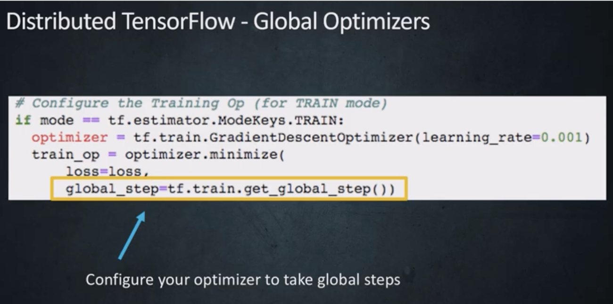
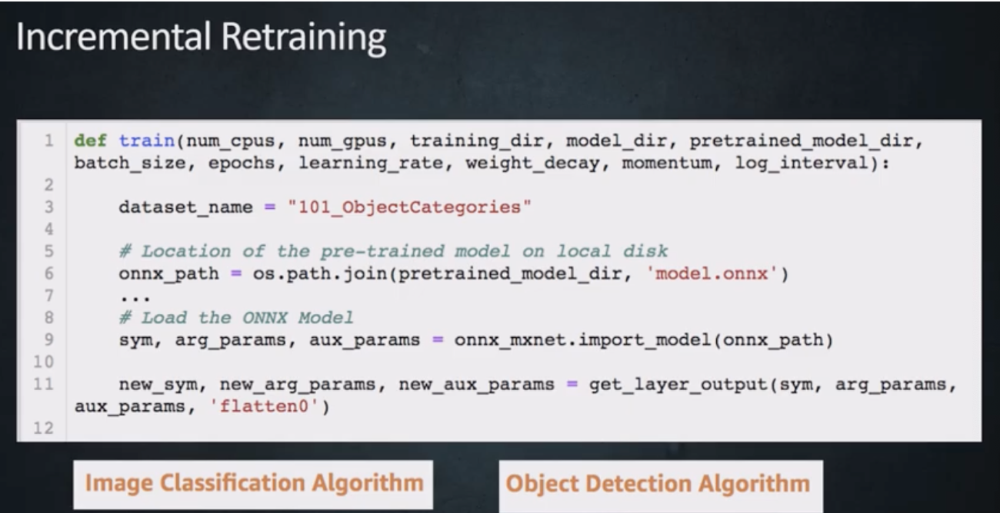
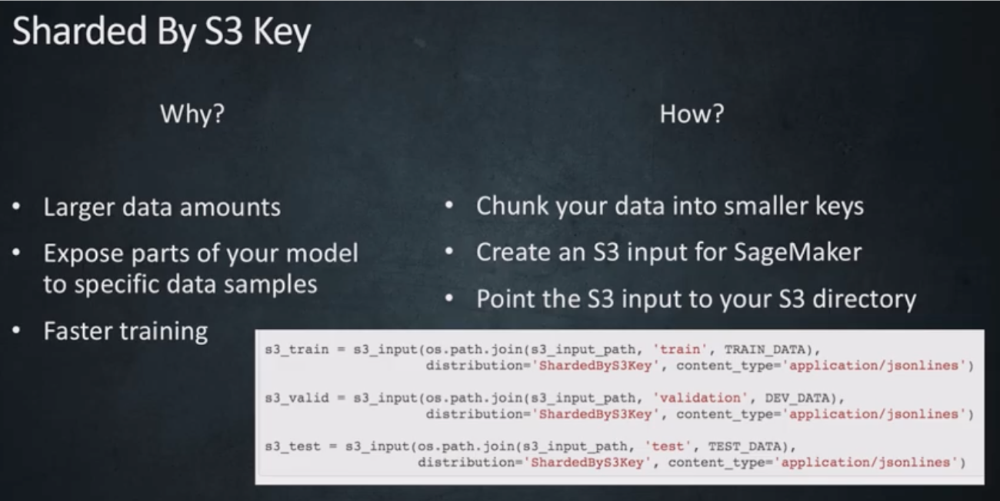
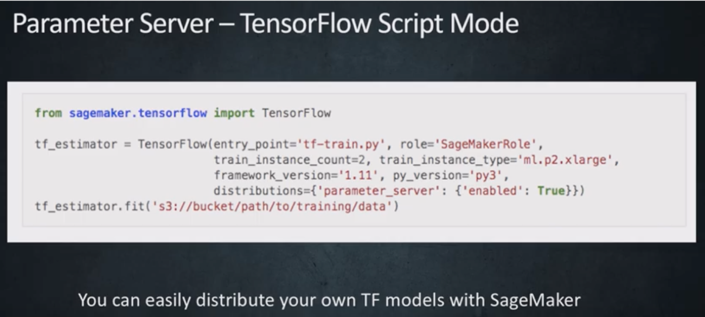

## Step 1. Create and Activate an AWS Account
* https://aws.amazon.com/premiumsupport/knowledge-center/create-and-activate-aws-account/ 

## Step 2. Apply the AWS Credits
* https://aws.amazon.com/awscredits/  

## Step 3. Create an S3 Bucket
* How to [Create an S3 Bucket](https://docs.aws.amazon.com/AmazonS3/latest/user-guide/create-bucket.html)

## Step 4. Choose a Region
* Amazon SageMaker [Supported Regions](https://docs.aws.amazon.com/general/latest/gr/rande.html#sagemaker_region)

## Step 5. Manage/Increase SageMaker Service Limits
* Check [Default Amazon SageMaker Service Limits](https://docs.aws.amazon.com/general/latest/gr/sagemaker.html#limits_sagemaker)
* How to [Request Limit Increase](https://docs.aws.amazon.com/servicequotas/latest/userguide/request-quota-increase.html)

## Step 6. Create a SageMaker Notebook
* Select [Instance Type](https://aws.amazon.com/sagemaker/pricing/instance-types/)
* Select “Create a New IAM Role”
* Select the S3 Bucket Created Above
* Select “Jupyter” or “JupyterLab” to Launch the Notebook
* Connect to a Public or Private GitHub or GitLab repo using [these](git-integration.md) instructions.

## Step 7. Train a Model using SageMaker Notebooks
* Run this **TensorFlow** MNIST [sample notebook](tensorflow/) using Distributed TensorFlow and SageMaker in Script Mode.
* Run this **PyTorch** MNIST [sample notebook](pytorch/) using **PyTorch** Distributed PyTorch and SageMaker in Script Mode.

## Step 8. Submit your Notebook and Trained Model to Kaggle
* https://deepfakedetectionchallenge.ai/

## Extras
## SageMaker Training
### Introduction to SageMaker Instance Types
* List of [SageMaker Instance Types](https://aws.amazon.com/sagemaker/pricing/instance-types/)
* Check to comply with Kaggle competition code requirements https://www.kaggle.com/c/deepfake-detection-challenge/overview/code-requirements

### Noteboook Examples using Tensorflow/Keras
* https://docs.aws.amazon.com/sagemaker/latest/dg/tf.html

### Notebook Examples using PyTorch
* https://docs.aws.amazon.com/sagemaker/latest/dg/pytorch.html

### Single Node SageMaker Training
* https://sagemaker.readthedocs.io/en/stable/using_tf.html#train-a-model-with-tensorflow

### Multi-Node SageMaker Training
* https://github.com/awslabs/amazon-sagemaker-examples/tree/master/advanced_functionality/distributed_tensorflow_mask_rcnn

### Fully Replicated - Full Copy from S3 Bucket to Each Node / Instance

### Sharded by S3 Key - Different Chunks of Data Copied from S3 Bucket to Each Node / Instance

## Custom SageMaker Containers 
* Convert the Notebook to a `train.py` File in Docker Image
* Run this [sample notebook](examples/custom-sagemaker-container/notebook.ipynb)

* Run the Docker Image as a SageMaker Training Job

## Alternative to Amazon SageMaker: Use Your Own Deep Learning AMIs
* AWS [Deep Learning AMIs](https://docs.aws.amazon.com/dlami/latest/devguide/what-is-dlami.html)
