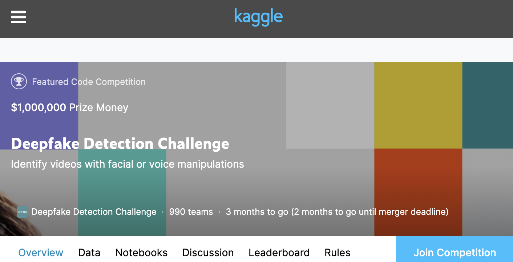
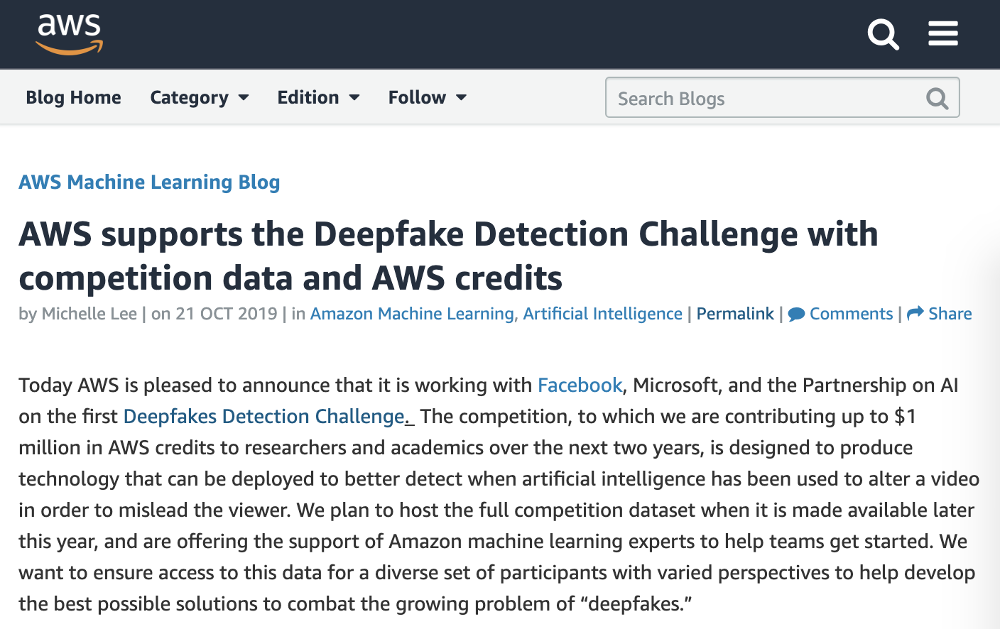
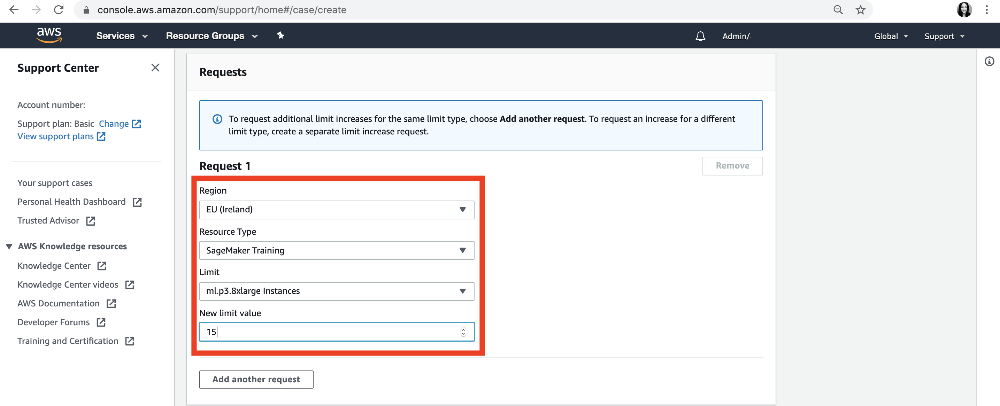
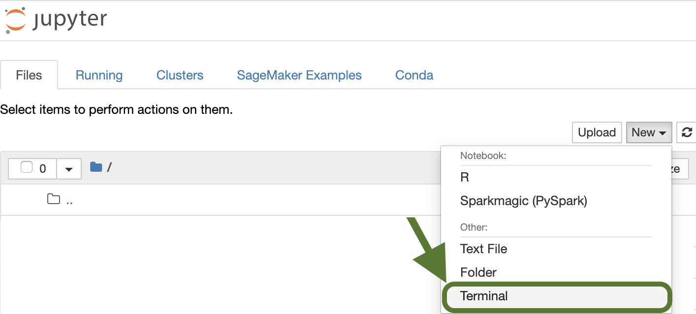

## Kaggle Competition
[](https://deepfakedetectionchallenge.ai/)
[](https://www.kaggle.com/c/deepfake-detection-challenge)

## Train Your Model with AWS
[](https://aws.amazon.com/blogs/machine-learning/aws-supports-the-deepfake-detection-challenge-with-competition-data-and-aws-credits/)

### Step 1:  Create and Activate Your AWS Account
* https://aws.amazon.com/premiumsupport/knowledge-center/create-and-activate-aws-account/ 

### Step 2:  Apply Your AWS Credits (If Applicable)
* https://aws.amazon.com/awscredits/  

### Step 3:  Create an S3 Bucket
* How to [Create an S3 Bucket](https://docs.aws.amazon.com/AmazonS3/latest/user-guide/create-bucket.html)

### Step 4:  Choose a Region
* Review the [Regions](https://docs.aws.amazon.com/general/latest/gr/rande.html#sagemaker_region) supported by Amazon SageMaker 

### Step 5:  Manage/Increase SageMaker Instance Limits (see detailed instructions [here](quota-increase.md))
[](quota-increase.md)
* Review the [Default Limits](https://docs.aws.amazon.com/general/latest/gr/sagemaker.html#limits_sagemaker) for Amazon SageMaker Service Limits
* Request a [Limit Increase](quota-increase.md) if needed via the [AWS Support Center](https://console.aws.amazon.com/support/home#/)
* Review the [SageMaker Instance Pricing](https://aws.amazon.com/sagemaker/pricing/instance-types/) for an overview of supported instance types


### Step 6:  Create a SageMaker Notebook Instance
* Select an [Instance Type](https://aws.amazon.com/sagemaker/pricing/instance-types/)
* Select “Create a New IAM Role”
* Select the S3 Bucket Created Above
* Select “Jupyter” or “JupyterLab” to Launch the Notebook
* Connect to a Public or Private GitHub or GitLab repo using [these](git-integration.md) instructions.

### Step 7:  Clone this GitHub Repo
* Open a New Terminal
()

* Clone this Repo using the Following Command
```
cd ~/SageMaker

git clone https://github.com/data-science-on-aws/deep-fake-detection-challenge
```

### Step 8:  Train a Model Using Your SageMaker Notebook Instance
* [**Sample TensorFlow Notebook**](tensorflow/) using Distributed TensorFlow and SageMaker.
* [**Sample PyTorch Notebook**](pytorch/) using Distributed PyTorch and SageMaker.
* [**Sample MXNet Notebook**](mxnet/) using Distributed MXNet and SageMaker.
* To adapt a custom training script to SageMaker, please follow [these instructions](https://sagemaker.readthedocs.io/en/stable/using_tf.html#adapting-your-local-tensorflow-script).

### Step 9:  Submit Your Trained Model to Kaggle
* [Competition Code Requirements](https://www.kaggle.com/c/deepfake-detection-challenge/overview/code-requirements)

## More Resources
* [Kaggle Challenge Introduction](https://www.kaggle.com/robikscube/kaggle-deepfake-detection-introduction)
* [Deepfake Starter Kit](https://www.kaggle.com/gpreda/deepfake-starter-kit)
* [Competition Code Requirements](https://www.kaggle.com/c/deepfake-detection-challenge/overview/code-requirements)
