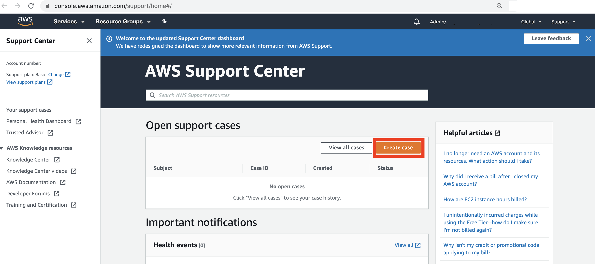
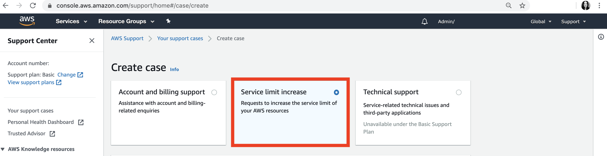
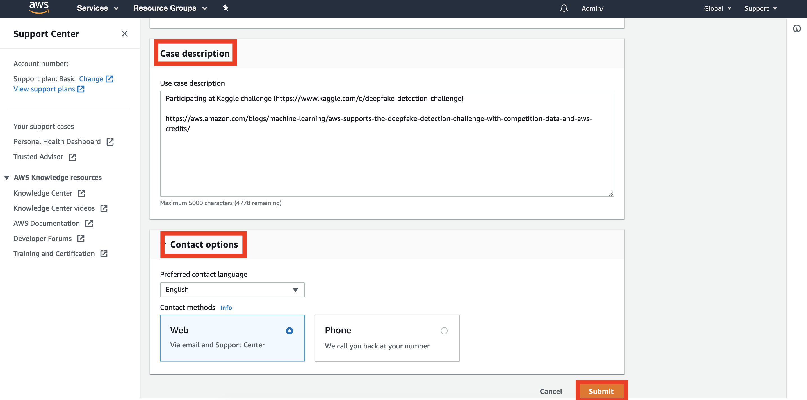

# How to increase your AWS Service Quotas for Amazon SageMaker

Your AWS account has default quotas, formerly referred to as limits, for each AWS service. 
Unless otherwise noted, each quota is Region-specific. 

## The default service quotas for Amazon SageMaker are listed [here](https://docs.aws.amazon.com/general/latest/gr/sagemaker.html#limits_sagemaker).

Please note that the service quotas may vary between different Amazon SageMaker services as described in the link shared above:

- Amazon SageMaker Notebooks
- Amazon SageMaker Automatic Model Tuning
- Amazon SageMaker Processing
- Amazon SageMaker Training and Managed Spot Training
- Amazon SageMaker Hosting
- Amazon SageMaker Batch Transform
- Amazon SageMaker Ground Truth

For model training you should look at the quota for **Amazon SageMaker Training and Managed Spot Training**. 

## Which instance type do I need?

Here's a list of [supported Amazon SageMaker instance types](https://aws.amazon.com/sagemaker/pricing/instance-types/) (ml.xxx) comparing the different instances in vCPU, GPU, Mem (GiB), GPU Mem (GiB) and Network Performance. 

You find the GPU-based instance types at "Accelerated Computing – Current Generation". 

## Request quota increase

You can request a quota increase using the AWS Support Center as follows:

### 1. Open the [AWS Support Center](https://console.aws.amazon.com/support/home#/) (sign in if necessary)
### 2. Choose ***Create case***

### 3. Choose ***Service limit increase***.

### 3. Fill in your request details

* Select the AWS Region you're working in
* Select the relevant service, e.g. SageMaker Training
* Select the limit to increase 
(e.g. limits per instance type like ml.p3.8xlarge, or number of instances overall)
* Set required new limit value

### 4. Add a case description and contact options, and hit ***submit***!

